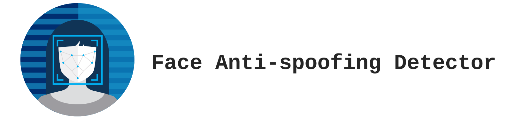
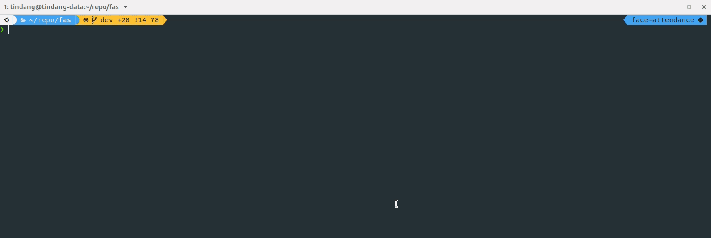
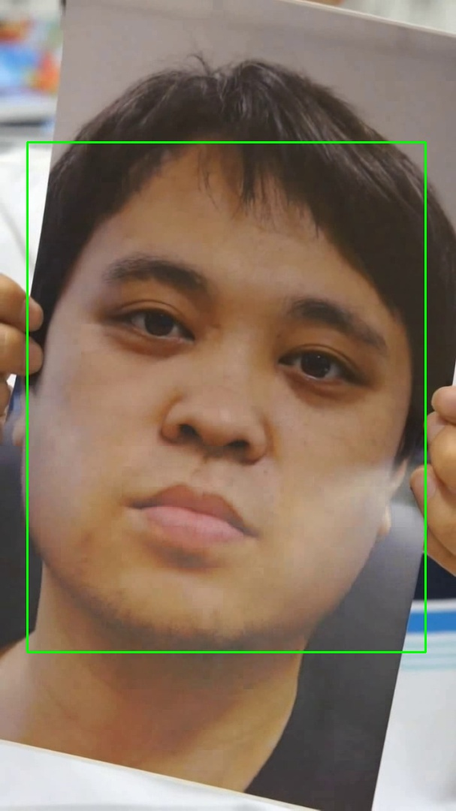
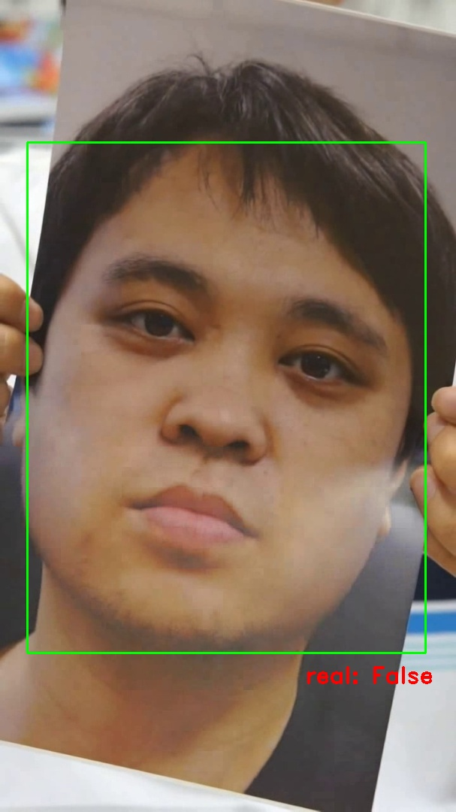
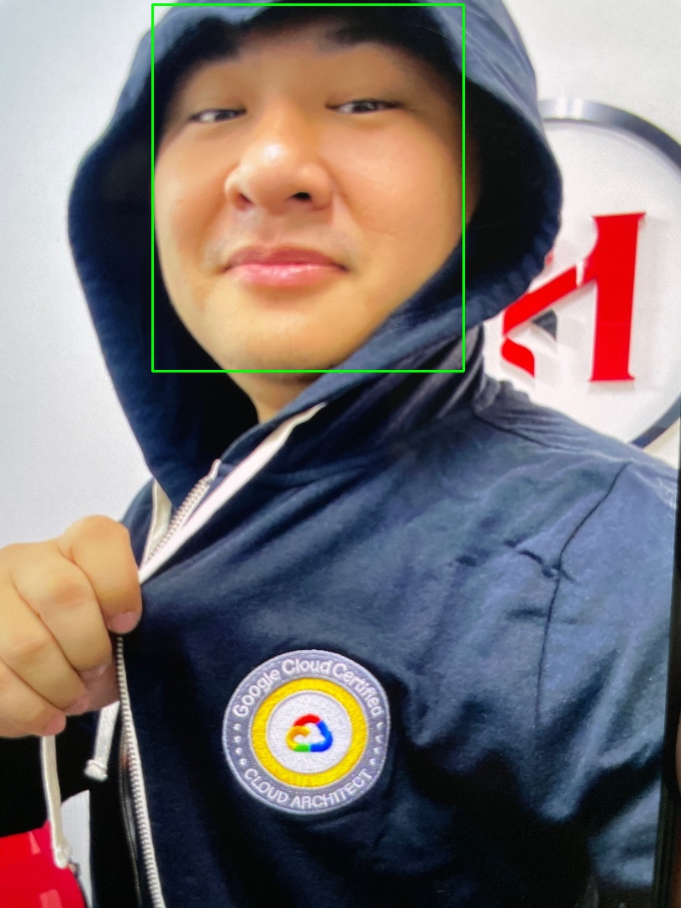
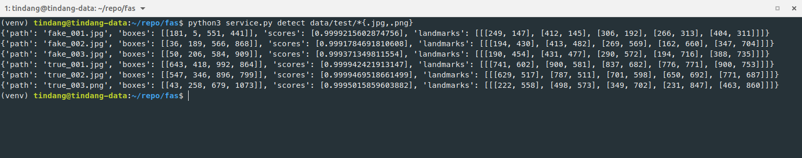
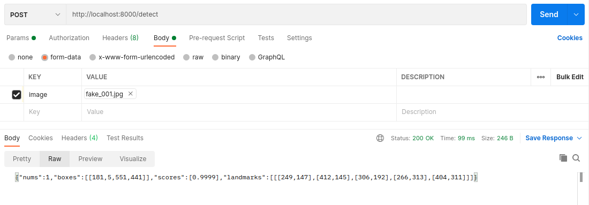
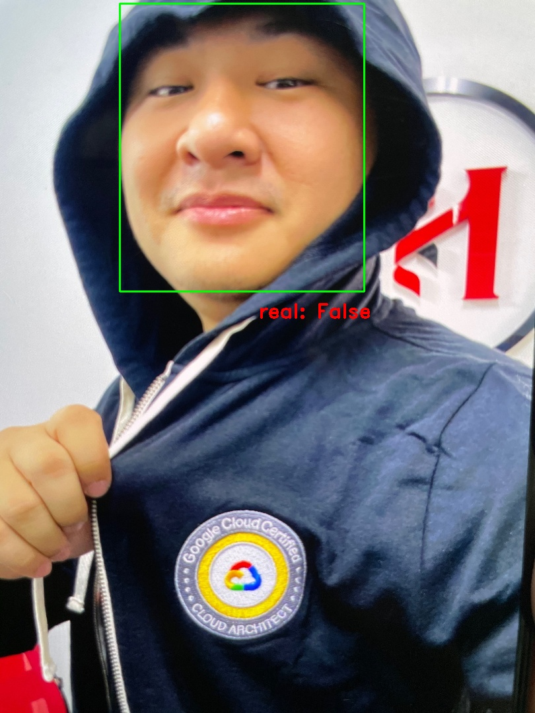
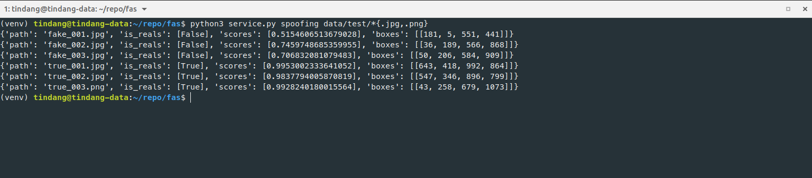

# Viet Money - Face detection & anti-spoofing

Pure Python - Face detection & anti-spoofing. Support Web API & Command-line interface.





## Prerequisite

<p>
    
    
    
</p>


### Manual 

---

- **Python 3.6**↑: https://www.python.org/downloads/
- **Pytorch 1.5.0**↑: https://pytorch.org/get-started/previous-versions/

```sh
# Install Pytorch cuda if using NVIDIA GPU device. Default: CPU device

> pip3 install torch==1.5.0+cpu -f https://download.pytorch.org/whl/torch_stable.html
```

  *or*

```shell
# CUDA 10.2
> pip3 install torch==1.5.0

# CUDA 10.1
> pip3 install torch==1.5.0+cu101 -f https://download.pytorch.org/whl/torch_stable.html

# CUDA 9.2
> pip3 install torch==1.5.0+cu92 -f https://download.pytorch.org/whl/torch_stable.html
```

- Python package requirements:

```shell
> pip3 install -r requirements.txt
```


###  Docker

---

- **Docker** v20.10.5↑: https://docs.docker.com/get-docker/
- **Docker Compose** v1.28.5↑: https://docs.docker.com/compose/install

**_Support Docker with environment setting_**:

```shell
# edit API config in `.example` or container env
> cp .example .env
> docker-compose build && docker-compose up -d
```


## Table of Contents

- [Viet Money - Face detection & anti-spoofing](#viet-money---face-detection--anti-spoofing)
  - [Prerequisite](#prerequisite)
    - [Local](#local)
    - [Docker](#docker)
  - [Table of Contents](#table-of-contents)
  - [Features](#features)
  - [Get started](#get-started)
  - [Documents](#documents)
    - [Python API](#python-api)
    - [Command-line interface](#command-line-interface)
    - [Web API](#web-api)
- [License](#license)
- [Contact](#contact)


## Features




### Face detection

---





### Face anti-spoofing detection

---





## Get started

> NOTE: all method work in RGB pixel format. *(OpenCV pixel format is BGR -> convert before using)*


### Face detection



- **Python API**
```python
from library.util.image import imread
from library.face_detector import FaceDetector

face_detector = FaceDetector("data/pretrained/retina_face.pth.tar")

image = imread("images/fake_001.jpg") # image in RGB format
faces = face_detector(image)

>>> faces # [[box, score, land_mark]]
[(array([181,   5, 551, 441], dtype=int32), 
  0.99992156, 
  array([[249, 147],
         [412, 145],
         [306, 192],
         [266, 313],
         [404, 311]], dtype=int32))]
```
- **CLI**

```shell
> python3 service.py detect data/test/*{.jpg,.png}
```




- **Web API**

```shell
> curl --location --request POST 'http://localhost:8000/detect' --form 'image=@"data/test/fake_001.jpg"'
```





### Face anti-spoofing detection

---

- **Python API**

```python
from library.util.image import imread
from library.face_detector import FaceDetector
from library.face_antspoofing import SpoofingDetector

face_detector = FaceDetector("data/pretrained/retina_face.pth.tar")
face_antispoofing = SpoofingDetector("data/pretrained/fasnet_v1se_v2.pth.tar")

image = imread("images/fake_001.jpg") # image in RGB format
faces = face_detector(image)

>>> face_antispoofing([box for box, _, _ in faces], image) # [(is_real, score)]
[(False, 0.5154606513679028)]
```



- **CLI**

```shell
> python3 service.py spoofing data/test/*{.jpg,.png}
```





- **Web API**

```shell
> curl --location --request POST 'http://localhost:8000/spoofing' --form 'image=@"data/test/fake_001.jpg"'
```


## Documents

### Python API

#### Face Detection

- class `library.face_detector.FaceDetector`:
  - `__init__`:
    - `model_path`: (str) Path of pre-trained model
    - `detect_threshold` (float): Threshold of confidence score of detector. *Default: 0.975*
	  - `scale_size` (int): Scale size input image. Recommend in [240, 1080]. *Default: 480*
	  - `device`: device model loaded in. *Default: cpu*
  - `process`: Detect faces in a image
  	- `image` (numpy.ndarray): image source
  	return: List[Tuple[List[int], float, List[List[int]]]] - [(box, score, land_mark)]

#### Face Anti Spoofing

- class `library.face_antspoofing.SpoofingDetector`:
  - `__init__`:
    - `model_path`: (str) Path of pre-trained model
    - `device`: device model loaded in. *Default: cpu*
	  - `face_size` (tuple(int, int)): model face input size. *Default: (80, 80)*
  - `predict`: Predict faces is spoof or not.
  	- `boxes`: face's boxes
  	- `image` (numpy.ndarray): image source
  	return: Sequence[Tuple[bool, float]] - *[(is_real, score)]*


### Command-line interface

---

#### Common options

```shell
>  python service.py --help
Usage: service.py [OPTIONS] COMMAND [ARGS]...

Options:
  --detector-model TEXT       Face detector model file path
  --detector-threshold FLOAT  Face detector model threshold
  --detector-scale INTEGER    Face detector model scale. >= 240
  --spoofing-model TEXT       Face anti-spoofing file path
  --device TEXT               Device to load model.
  --version                   Show the version and exit.
  --help                      Show this message and exit.

Commands:
  api       Run service as API
  detect    Detect face in images
  spoofing  Detect spoofing face in images

```


#### Face Detection

---

```shell
> python service.py detect --help
Usage: service.py detect [OPTIONS] IMAGES...

  Detect face in images

Options:
  -j, --json PATH  Export result to json file
  -q, --quiet      Turn off STD output
  -c, --count      Counting image during process
  -y, --overwrite  Force write json file.
  --help           Show this message and exit.

```

- Input: image's path *(support file globs)*  
  Example: `python service.py detect ./*{.jpg,.png}` - match with any file with extension is `jpg` and `png`.
  
- Output option:
    - `--json PATH`: Export result to JSON file    

    ```json
    {
        "nums": "int",
        "boxes": "List[int]",
        "scores": "List[float]",
        "landmarks": "List[int]"
    }
    ```
  
    - `--quiet` Turn off STD output
    - `--count` Counting image during process
    - `--overwrite` Force write JSOn file.


#### Face Anti Spoofing

---

```shell
> python service.py spoofing --help
Usage: service.py spoofing [OPTIONS] IMAGES...

  Detect spoofing face in images

Options:
  -j, --json PATH  Export result to json file
  -q, --quiet      Turn off STD output
  -c, --count      Counting image during process
  -y, --overwrite  Force write json file.
  --help           Show this message and exit.

```
- Input: image's path *(support file globs)*  
  Example: `python service.py spoofing ./*{.jpg,.png}` - match with any file with extension is `jpg` and `png`.
  
- Output option:
    - `--json PATH`: Export result to json file    

    ```json
    {
        "nums": "int",
        "is_reals": "List[bool]",
        "scores": "List[float]",
        "boxes": "List[int]"
    }
    ```
  
    - `--quiet` Turn off STD output
    - `--count` Counting image during process
    - `--overwrite` Force write json file.


#### Web API Hosting

---

```shell
> python service.py api --help
Usage: service.py api [OPTIONS]

  Run service as API

Options:
  --host TEXT     API host. Default: localhost
  --port INTEGER  API port. Default: 8000
  --version TEXT  API version.
  --help          Show this message and exit.
```
**_Run with default uvicorn setting_**:

```shell
> python service.py api

INFO:     Started server process [19802]
INFO:     Waiting for application startup.
INFO:     Application startup complete.
INFO:     Uvicorn running on http://localhost:8000 (Press CTRL+C to quit)
```

**_Support Docker with environment setting_**:

```shell
# edit API config in `.example` or container env
> cp .example .env
> docker-compose build && docker-compose up -d
```


### Web API

---

#### Face Detection

- Method: `POST`
- URL: `/detect`
- Form-data params:
  - images:  `File` or `URL of image`


#### Face Anti Spoofing

- Method: `POST`
- Path: `/spoofing`
- Form-data params:
  - images:  `File` or `URL of image`


# License

[Licensed under the Apache License, Version 2.0](LICENSE)


# References

- [Pytorch_Retinaface](https://github.com/biubug6/Pytorch_Retinaface)
- [Silent-Face-Anti-Spoofing](https://github.com/minivision-ai/Silent-Face-Anti-Spoofing)


# Contact

- **Author**: Tin Dang   
- **Email**: tindht@vietmoney.vn   
- **Website**: [www.vietmoney.dev](www.vietmoney.dev)